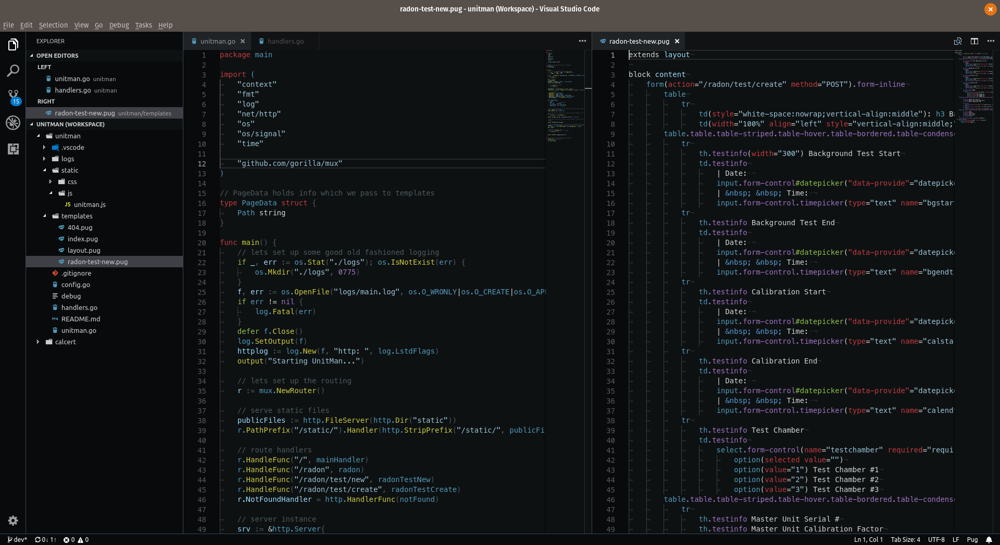

# Seti (Improved) for Visual Studio Code

The existing Seti UI ports appear to just take the colors and stick them into a vscode theme, without actually matching the same tokens with their Atom equivalents. This is my attempt to fix that.

Original Atom UI theme: https://github.com/jesseweed/seti-ui  
Original Atom syntax theme: https://github.com/jesseweed/seti-syntax

My hope is that this will more accurately reflect Seti_UI+syntax as of versions 1.10.0 and 1.1.3 respectively, with all default options. This is very much a WIP. I made it work with the languages I'm using daily at work right now, but I'm sure others will need some tweaking. Feel free to open an issue or submit a PR.

Because of how vscode works, both UI and syntax are included in one extension
here.